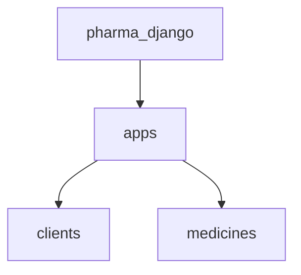

# Pharma-Django

Este é um projeto de farmácia online desenvolvido em Django.

## Funcionalidades

- Cadastro de clientes
- Cadastro de produtos
- Busca de produtos

## Instalação

1. Clone este repositório
2. Crie e ative um ambiente virtual
3. Instale as dependências com o comando `pip install -r requirements.txt`
4. Rode as migrações do banco de dados com o comando `python manage.py migrate`
5. Crie um superusuário com o comando `python manage.py createsuperuser`
6. Inicie o servidor com o comando `python manage.py runserver`

## Uso

Acesse a aplicação através do seu navegador de preferência, utilizando o endereço `http://localhost:8000/`. Você será redirecionado para a página inicial da aplicação, onde poderá realizar buscas por produtos, se cadastrar ou logar como cliente.

## Documentação

Abaixo contém um diagrama com um resumo das aplicações do projeto atual:

